# Setting Up a Django Project

## Part one

Here we are going to do three important steps: 
1. Create a project folder in your 
2. Create a virtual environment for our project  
3. Install Django
   
 
 
 

### Project Folder

First We have to create a new folder, in our example i created the following folder. 
Du_CAAS_Upload_Attendence

> mkdir Du_CAAS_Upload_Attendence 

 

> cd Du_CAAS_Upload_Attendence

 

### Create a Virtual Environment for the Project
---
create a new virtual environment in the folder with, then activate it
> python3 -m venv caasEnv

<pre>
-m means module, and the name of the module to be opened is venv 
the code "python -m venv caasEnv", means python open the module named venv and create a new virtual environment called caasEnv
</pre>
 

> source caasEnv/bin/activate 

you can also use this code directly to get the virtual environment automatically activated, and install the application's dependencies.

>python -m pip install -r requirements.txt

### Install Django inside the project folder
--- 
Notice:Note that when the virtualenv is activated, python and pip are added to PATH from the virtualenv, so you don't need to worry about using python3 or pip3. And all your packages will be installed under ./venv, well isolated from everything else in your system.
 
That is why we can use pip install django no need for pip3

>pip install django

you can also use this code , to install any package 
>python3 -m pip install django
 

you can verify django installation by:
>django-admin --version 
 
 
---- 
 

## Part Two

Here we are going to do two important steps: 
1. Creating the primary application database "DUAtt"
2. Creating a new application "addatt".
3. Adding the new created project to settings.py
4. creating the addatt urls.py and configuring the URLs to the application
5. Creating the view functions inside the addatt

 

### Django New project and new Application
---
Create a new Django project "DUAtt", after that create a new Application. We are going to calle it "addatt" short for add attendence
> django-admin startproject DUAtt
 

To create the new application, you have to open the folder DUAtt, which newly created, then from inside that folder you have to issue the following command:

> python manage.py startapp addatt

This will add a primary app, but we must create other application, the django project is a list of connected application. But keep in maind the primary app is the main app from which we can call other application
 
The primary app will take the name the of the project folder. for example in our case it will be "DUAtt"

after creating the new app it is important to go to the settings.py file and add the new app "addatt" into the "INSTALLED_APPS" section

  
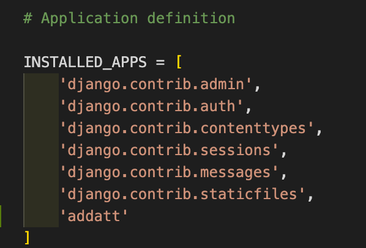

---

### Creating a URL and a View for the Web Application
---
Inside the primary app, which is ‘DUAtt,’ make the following configurations. Open ‘urls.py’ and add the pattern to point to the ‘tutorial’ app. Import ‘include’ and add the path to the ‘urls.py’ file inside ‘addatt’.

> path(‘’,include(‘addatt.urls’)), 
> path('addatt/' include('addatt.urls)),

here if the user type the web address without andy extra details, it will open the addatt app, and also if he typed addatt as extra details in the website it also will open the addatt app

 
Notice: you may need to add "include" library  

---

 
 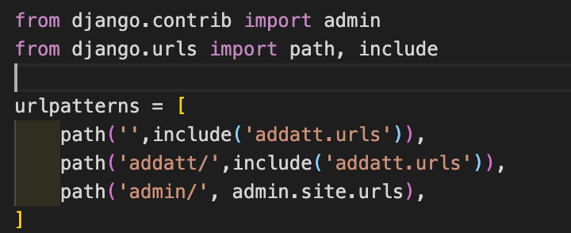
this code means when the site start go to the application named "addatt" and open urls file and check for lins there. The file urls.py, not yet created and you have to create it manually.

 

 

### Homepage for addatt app
--- 
Go to ‘addatt.urls.py’ and import ‘views’ Add the app name for future reference and add the path to point to a homepage view for the tutorial app

>Path(‘’,views.homepage, name=“homepage”)

 
See the image bellow a new file urls.py created and inside it the above code added
we have to add application namespace " app_name='addatt', this is the namespace, which we use to identify this app especially when we using hyperlinks
--- 
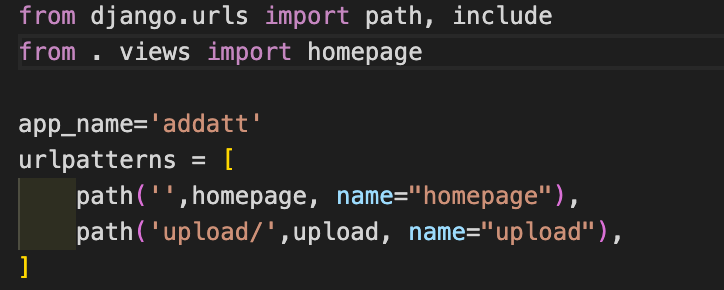

 

### Homepage View for
--- 
But so far we don’t have any view called homepage. So, add a simple HttpResponse view called homepage. Don’t forget to import HttpResponse from django.http as shown below:
> def homepage(request): 
> &emsp;return HttpResponse("First App")

 
here we imported "from django.http import HttpResponse" library

---
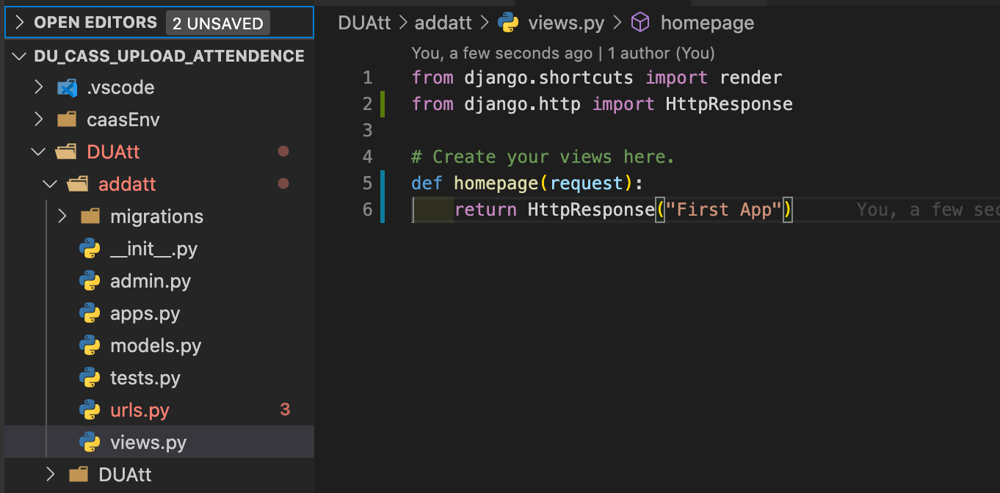

### Start your App
--- 
Now, boot up the web server and run the following command
> python manage.py runserver

---

## Part Three

Here we are going to create the templates in our projects 
1. create a new folder and call it template folder.
2. configure settings.py files for template folder.
3. Create a view that renders the request and maps to a template inside the template directory.
4. Configuring the STATIC file section in the settings.py file

---
Inside your project folder create a new folder and call it template. 
Django template is a way to dynamically generate HTML, XML, and PDF files in Django web framework. Django template contains the static parts of a desired HTML output and some special syntax that describes how dynamic content will be inserted.

 
This image shows the project structure after adding the folder templates

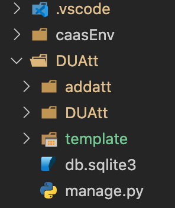

 

All HTML files required in a project are stored inside a folder called template. But in order to tell Django to look for templates inside the directory, we have to perform some configuration.

 

Create an HTML page for our addatt home inside the template directory. Let us name it ‘home.html’

 

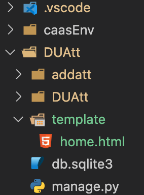
 

Go to settings.py and make the following template configurations. Here, we are defining the directory path where Django should look for the template source files

> [os.path.join(BASE_DIR,'template')]

please checkout the images bellow 

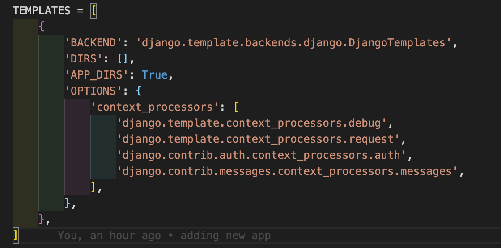

 
please add the template configuration 
 

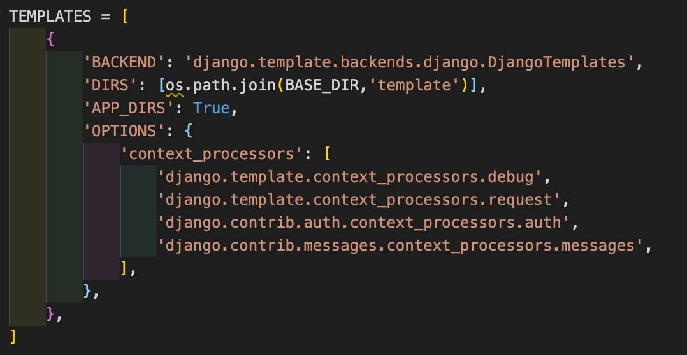

 
 

### Create a view that renders the request and maps to a template inside the template directory

---

 
This view or view function is created inside the ‘addatt’ application, in the views.py file. Here, this view function is taking the request for the home page, and then renders a template called ‘home.html’, which is inside the template folder.
 

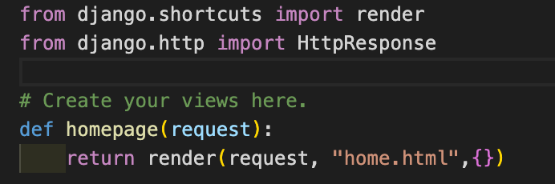

 
 

Static files

Open the settings.py file and add the following code to the end of the file: 

`# Static files (CSS, JavaScript, Images)` 

> STATIC_URL = '/static/'

`# default static files settings for PythonAnywhere.` 
`# see https://help.pythonanywhere.com/pages/DjangoStaticFiles for more info` 
>MEDIA_ROOT = os.path.join(BASE_DIR, 'media') 
>MEDIA_URL = '/media/' 
>STATIC_ROOT = os.path.join(BASE_DIR, 'static') 
>STATIC_URL = '/static/' 

 
 
 

## Part Four

Here in this section we are going to make the following changes to our project: 
1. Configure the urls.py file in the primary application to display static files.
2. Create the upload.html.
3. Create a new view function inside the views.py to display the upload.html.
4. Configure the urls.py file to display the upload.html.
 
 
### The Basics of File Upload With Django

When files are submitted to the server, the file data ends up placed in **request.FILES.**  
The request.FILES is a dictionary-like object. Each key in request.FILES is the name from the `<input type="file" name="" />`.  
Each value in request.FILES is an UploadedFile instance. 

It is mandatory for the HTML form to have the attribute enctype="multipart/form-data" set correctly. Otherwise the request.FILES will be empty. It is important that the form must be submitted using the POST method.

 

Django can handle uploaded files easily, it has proper models such as "FileField and ImageField. 
The files uploaded to the FileField or ImageField are not stored in the database but in the filesystem. The FileFeld and ImageFiled, created in the database as string field (usually VARCHAR), containing the reference to the actual file. It is important to know that if you delete the string reference in the database, the actual file will not be deleted automatically, only the reference will be delete, therefore extra work needed to delete the actual file

 

It is important to set **MEDIA_URL** and **MEDIA_ROOT** in your project’s settings.py.

MEDIA_URL = '/media/'
MEDIA_ROOT = os.path.join(BASE_DIR, 'media')

 
In the development server you may serve the user uploaded files (media) using :
 
Go to the primary app and open the urls.py file and add the following files 
 
>from django.conf import settings 
>from django.conf.urls.static import static 
 
>urlpatterns = [ 
&emsp; # Project url patterns... 
]

>if settings.DEBUG: 
&emsp;urlpatterns += static(settings.MEDIA_URL, document_root=settings.MEDIA_ROOT)

 

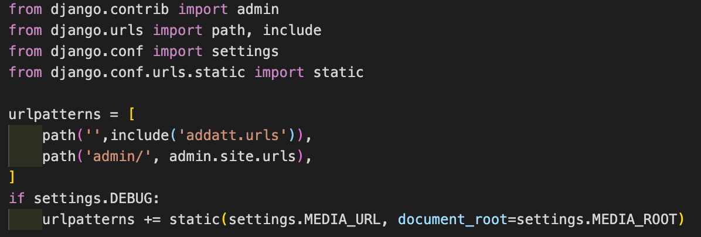

 

--- 
### Basic File Upload (Normal way without using the Model and Forms)
Open template folder and create a new html page and name it upload.html 
inside that page add the following code  
 

**upload.html** 

``

``

`` 
 &emsp; `<form method="post" enctype="multipart/form-data">` 
     &emsp; &emsp;`` 
     &emsp; &emsp;`<input type="file" name="myfile">` 
     &emsp; &emsp;`<button type="submit">Upload</button>` 
   &emsp;`</form>` 

   &emsp;`` 
     &emsp; &emsp;`
File uploaded at: <a href="{{ uploaded_file_url }}">{{ uploaded_file_url }}</a>
` 
  &emsp;`` 

   &emsp;`
<a href="">Return to home</a>
` 
`` 

 

Now let go to the views.py file and add the following code  

**views.py** 

`from django.shortcuts import render` 
`from django.conf import settings`  
`from django.core.files.storage import FileSystemStorage` 

`def uploadfl(request):` 
&nbsp;&nbsp;&nbsp;&nbsp;` request.method == 'POST' and request.FILES['myfile']:` 
&nbsp;&nbsp;&nbsp;&nbsp;` myfile = request.FILES['myfile']` 
&nbsp;&nbsp;&nbsp;&nbsp;` fs = FileSystemStorage()` 
&nbsp;&nbsp;&nbsp;&nbsp;` filename = fs.save(myfile.name, myfile)` 
&nbsp;&nbsp;&nbsp;&nbsp;` uploaded_file_url = fs.url(filename)` 
&nbsp;&nbsp;&nbsp;&nbsp;` return render(request, 'upload.html', {'uploaded_file_url': uploaded_file_url})`
&nbsp;&nbsp;&nbsp;&nbsp;` return render(request, 'upload.html')` 

 

---
### File Upload With Model Forms

---
Now, this is a way more convenient way. Model forms perform validation, automatically builds the absolute path for the upload, treats filename conflicts and other common tasks.

Inside the models.py file, add the following codes: 

`from django.db import models`

`class Document(models.Model):` 
&nbsp;&nbsp;&nbsp;&nbsp;`    description = models.CharField(max_length=255, blank=True)` 
&nbsp;&nbsp;&nbsp;&nbsp;`    document = models.FileField(upload_to='documents/')` 
&nbsp;&nbsp;&nbsp;&nbsp;`    uploaded_at = models.DateTimeField(auto_now_add=True)` 

 
here we are going to create a forms.py file, and all the code bellow to it.
**forms.py** 
`from django import forms` 
`from uploads.core.models import Document` 

`class DocumentForm(forms.ModelForm):` 
&nbsp;&nbsp;&nbsp;&nbsp;    `class Meta:` 
&nbsp;&nbsp;&nbsp;&nbsp;        `model = Document` 
&nbsp;&nbsp;&nbsp;&nbsp;        `fields = ('description', 'document', )` 

 

**views.py** 
`def model_form_upload(request):` 
&nbsp;&nbsp;&nbsp;&nbsp;    `if request.method == 'POST':` 
&nbsp;&nbsp;&nbsp;&nbsp;        `form = DocumentForm(request.POST, request.FILES)` 
&nbsp;&nbsp;&nbsp;&nbsp;        `if form.is_valid():` 
&nbsp;&nbsp;&nbsp;&nbsp;            `form.save()` 
&nbsp;&nbsp;&nbsp;&nbsp;            `return redirect('home')` 
&nbsp;&nbsp;&nbsp;&nbsp;    `else:` 
&nbsp;&nbsp;&nbsp;&nbsp;       `form = DocumentForm()` 
&nbsp;&nbsp;&nbsp;&nbsp;    `return render(request, 'core/model_form_upload.html', {`
&nbsp;&nbsp;&nbsp;&nbsp;        `'form': form`
&nbsp;&nbsp;&nbsp;&nbsp;    `})` 

 
 
 
 

## Part Five

### Migration

Django is designed to work with a relational database, stored in a relational database management system like PostgreSQL, MySQL, or SQLite. 
All database systems supported by Django use the language SQL to create, read, update and delete data in a relational database.

 
Working directly with SQL can be quite cumbersome, so to make your life easier, Django comes with an object-relational mapper, or ORM for short. The ORM maps the relational database to the world of object oriented programming. Instead of defining database tables in SQL, you write Django models in Python. Your models define database fields, which correspond to the columns in their database tables.

 
Here’s an example of how a Django model class is mapped to a database table:
 

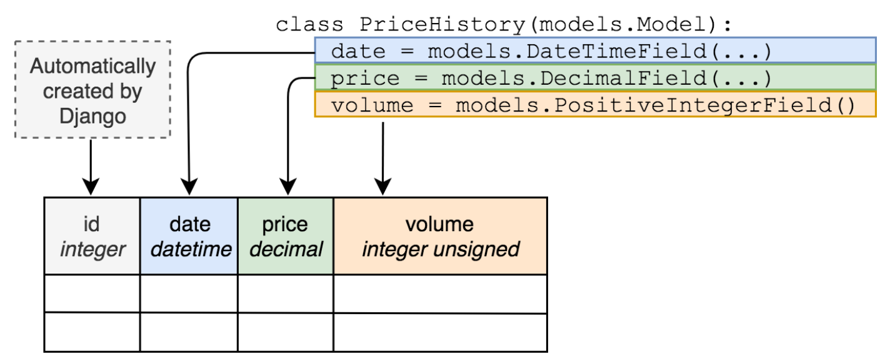

---
_source:https://realpython.com/django-migrations-a-primer/_
 
---
defining a model class in a Python file will not make a database. We have to make migration in order to creating the database tables. Additionally, whenever you make a change to your models, like adding a field, the database has to be changed too. Migrations handle that as well.

 
 
 
 
 
 
 
 
 
 
 
 

# References to

* https://simpleisbetterthancomplex.com/tutorial/2016/08/01/how-to-upload-files-with-django.html
* https://docs.djangoproject.com/en/3.1/topics/http/file-uploads/
* https://intellipaat.com/blog/tutorial/python-django-tutorial/django-template-models-registration/
* https://realpython.com/django-migrations-a-primer/
