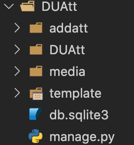
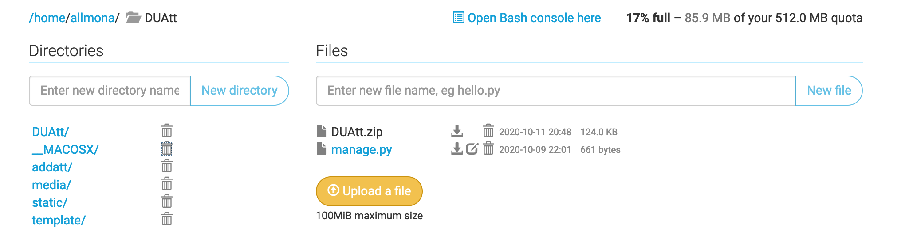
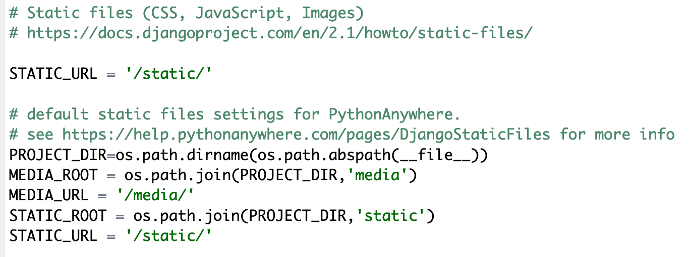
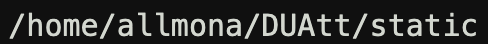
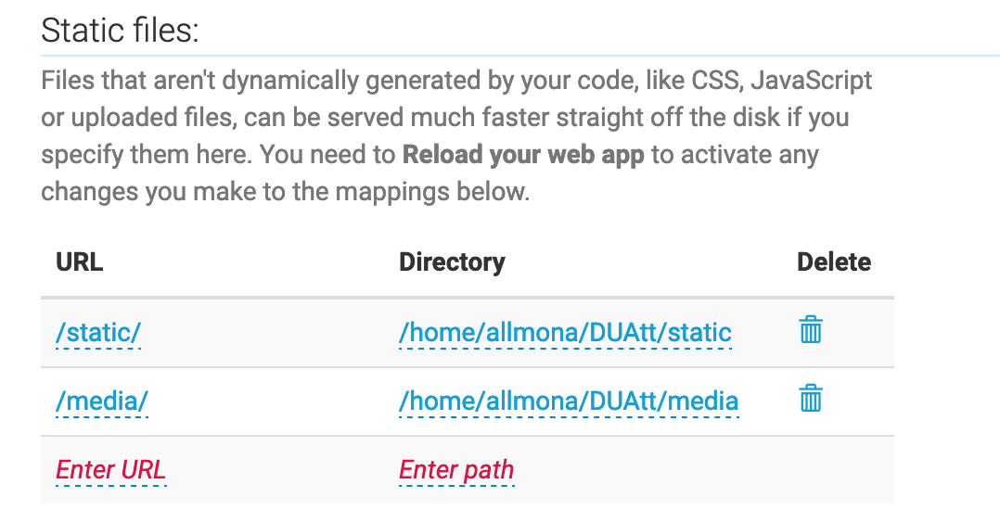

# Deploy to Pythonanywhere (using zip file method)

Create a zip file of your project.

here for example yoj can select the inner folders, and not the main folder "DUAtt"  
select the following folders and put them in one zip file 
* addatt
* DUAtt
* media
* template
* manage.py

these folders and files will be in one zip file and then from within your pythonanywhere project you upload them  

 
First thing befor uploading the zip file and unzip its contents, you have go to pythonanywhere and create a new web application 

 
follow the instructions, and make sure to name the project as the zip file name, for example if the zip file name is "DUAtt" Then the project also named "DUAtt"
 
go to the project (from files) open it, and inside the project folder, upload the project zip file
then open console from within the same folder
Tyep unzip project.zip file and if there any message appears regarding overwritte choose All.
 

after unziping the project folder, open it and go to the settings file and do the following changes 
`#SECURITY WARNING: don't run with debug turned on in production!` 
`DEBUG = False` 
`# Static files (CSS, JavaScript, Images)` 
`# https://docs.djangoproject.com/en/2.1/howto/static-files/` 

`STATIC_URL = '/static/`

`# default static files settings for PythonAnywhere.` 
`# see https://help.pythonanywhere.com/pages/DjangoStaticFiles for more info` 
`PROJECT_DIR=os.path.dirname(os.path.abspath(__file__))` 
`MEDIA_ROOT = os.path.join(PROJECT_DIR,'media')` 
`MEDIA_URL = '/media/'` 
`STATIC_ROOT = os.path.join(PROJECT_DIR,'static')` 
`STATIC_URL = '/static/'` 

 

 
after that go the console, and issue the following command to collect all static files 
`python3.7 manage.py collectstatic` 

then copy the static file folder, which appears in the console, and go to the web applicaiotn table and change the static file folder in the static files section. 

reload the webpage and open it.