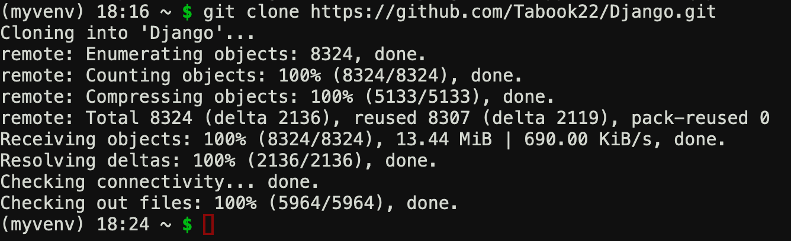
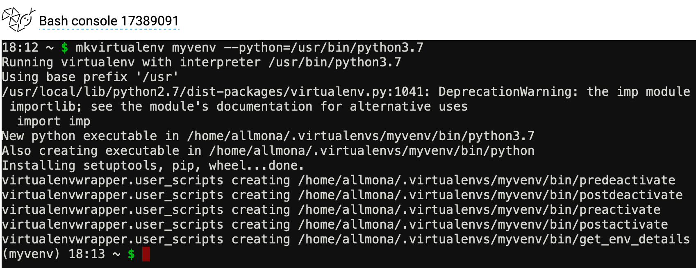
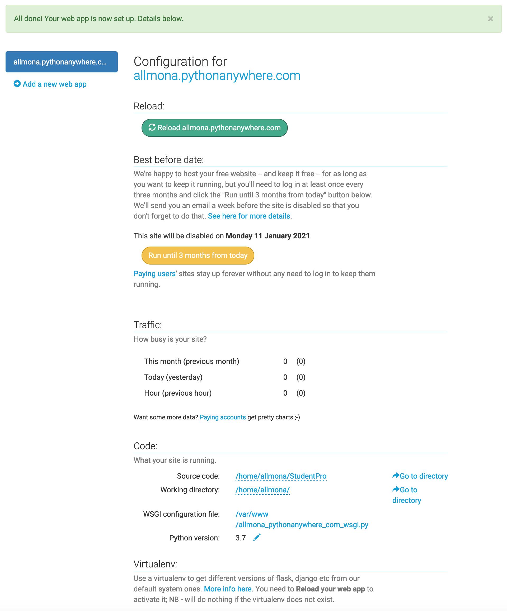

# Deploying an existing Django project on PythonAnywhere

 The source is: https://help.pythonanywhere.com/pages/DeployExistingDjangoProject/ 

Deploying a Django project on PythonAnywhere is a lot like running a Django project on your own PC. You'll use a virtualenv, just like you probably do on your own PC, you'll have a copy of your code on PythonAnywhere which you can edit and browse and commit to version control.

The main thing that's different is that, instead of using the Django dev server with manage.py runserver and viewing your site on localhost, you'll create what we call a Web app via the Web tab in our UI, and then configure it with a WSGI file whose job is simply to import your Django project.

And then your site will be live on the real, public Internet. woo!

The steps involved are:-

* Upload your code to PythonAnywhere
* Set up a virtualenv and install Django and any other requirements
* Set up your web app using the manual config option
* Add any other setup (static files, environment variables etc)

 
 

## Upload your code to PythonAnywhere
We are going to clone our git project (There are other ways to upload your code to pythonanywhere, like for example uploading a zip file). 
We will assume that the code is in GitHub, all we have to do is to just clone it from the Bash Console.

> git clone https://github.com/Tabook22/Django.git

 

## Configure Virtual Environment

open a new bash console 
type the following: 
`mkvirtualenv myvenv --python=/usr/bin/python3.7`
 

When you close your pythonanywhere applicaiton and want to open and activate your virtual environment, type: 
`workon myvenv`

 
Now our virtual environment is active.
 
Now we need to install Django 

`pip install django`
 

 

to check to see if django is installed type the following; 

`python -m django --version`
 

which means python open module django and check the version 

## Setting up your Web app and WSGI file
t this point, you need to be armed with 3 pieces of information:

* The path to your Django project's top folder -- the folder that contains "manage.py", eg /home/myusername/mysite
* The name of your project (that's the name of the folder that contains your settings.py), eg mysite
* The name of your virtualenv, eg mysite-virtualenv

 

### Create a Web app with Manual Config
Head over to the Web tab and create a new web app, choosing the "Manual Configuration" option and the right version of Python (the same one you used to create your virtualenv). 

 

 
Select Django
 
 
 
 

 

Here we are going to select the python version, for example we are going to select python 3.7
 
 
 
 

Here we are going to choose our project name, for example "StudentPro" offcourse you can choose any project name you want. 
 
 
 
 

### Enter your virtualenv name
Once that's done, enter the name of your virtualenv in the Virtualenv section on the web tab and click OK.

 
 

add the virtual environment, you created in our example the virtual environment is "myvenv"
 
 

 
 
If every thing works fine you can click on Reload button and
 

 
 
If there is no error you will see the following webpage
 

 

--- 
 
 
 
 
 
 
 
 

# Creating a new Django project on PythonAnywhere

Here we are going to create a Django project from secrach, not deploying it like what we did in the previous section above.

## Configure Virtual Environment
The first thing we need to do is to configure a new virtual environment 
open a new bash console 
type the following: 
`mkvirtualenv myvenv --python=/usr/bin/python3.7`
 

 

When you close your pythonanywhere applicaiton and want to open and activate your virtual environment, type: 
`workon myvenv`

 
Now our virtual environment is active.
 
Now we need to install Django 

`pip install django`

 

to check to see if django is installed type the following; 

`python -m django --version`
 

which means python open module django and check the version

 

now we are going to start our django project 
`django-admin startproject myproject` 

"myproject" is the name of the project which i want to start

 
now change your diractory into "myproject"  

`cd myproject`

 

now we are going to start our first app in that project (myproject) 

`django-admin startapp myapp`

 

#

Now , we have to go to the web from our dashboard and do the following steps: 
* change the virtual environment to the new virtual environment we just created 
  
* we need also to change the source code, to point to our application "myapp" 
  
* Go to wsgi.py configuration file and past the following code their 
  `# +++++++++++ DJANGO +++++++++++` 
`# To use your own Django app use code like this:` 
`import os` 
`import sys` 
 

`# assuming your Django settings file is at '/home/myusername/mysite/mysite/settings.py'` 
`path = '/home/myusername/mysite'` 
`if path not in sys.path:` 
`    sys.path.insert(0, path)` 
 

`os.environ['DJANGO_SETTINGS_MODULE'] = 'mysite.settings'` 

 

`## Uncomment the lines below depending on your Django version` 
`###### then, for Django >=1.5:` 
`from django.core.wsgi import get_wsgi_application` 
`application = get_wsgi_application()` 
`###### or, for older Django <=1.4` 
`#import django.core.handlers.wsgi` 
`#application = django.core.handlers.wsgi.WSGIHandler()` 

then we have to do change  "mysite.settings" to myproject.settings, and "path='/home/muusername/mysite'" to path='/home/tabook22/myproject' 
 
the username in my case is tabook22, and the name of the project is myproject
 

the next last step , go to your settings.py file and change the ALLOWED_HOSTS=[] to ALLOWED_HOSTS=['tabook22.pythonanywhere.com'], this is my website, it just my username and the pythonanywhere.com.  

also go the INSTALLED_APPS and add the name of your application you just created which is called "myapp"